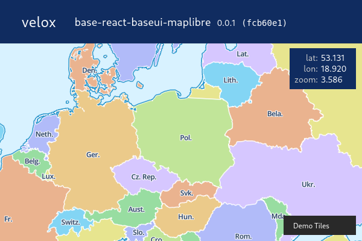

# velox-maps

React maps-app starter (baseweb).

<br />


## see the [live demo](https://drmats.github.io/velox-maps/)

<p align="center">
    <a href="https://drmats.github.io/velox-maps/" target="_blank">
        
    </a>
</p>

<br />


## content

### base branch

[velox:base-react-baseui-styled](https://github.com/drmats/velox/tree/base-react-baseui-styled)

### configured environments

* typescript
* babel
* eslint
* webpack
* webpack-dev-server
* react

### base libraries

* [@xcmats/js-toolbox](https://drmats.github.io/js-toolbox/)
* [mem-box](https://drmats.github.io/mem-box/)
* redux
* react-redux
* [red-g](https://drmats.github.io/red-g/)
* redux-thunk
* immer
* prop-types
* lodash.throttle

### ui

* baseweb.design

### mapping libraries

* maplibre-gl
* react-map-gl

<br />


## development

```
npm i
npm run lint
npm run dev
```

<br />


## production build

```
npm run build
```

<br />


## license

**velox-maps** is released under the BSD 2-Clause license. See the
[LICENSE](https://raw.githubusercontent.com/drmats/velox-maps/master/LICENSE)
for more details.
